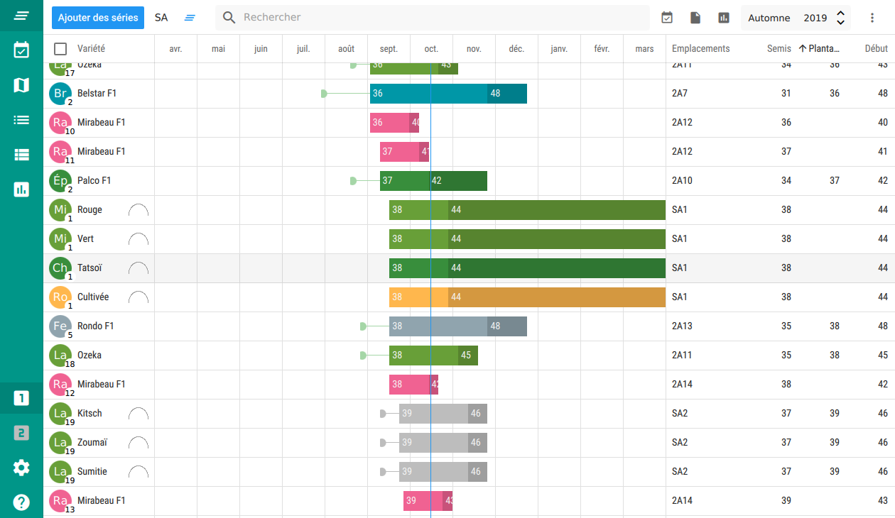

# Qrop

## Introduction

[Qrop](https://qrop.frama.io) is a crop planning and record keeping free
software designed by market gardeners, for market gardeners, with the help of
the wonderful French coop [L'Atelier paysan](https://latelierpaysan.org).

Qrop is available on GNU/Linux, macOS and Windows.

**Warning:** this is alpha software with known bugs. It runs, and work at least
some of the times, but use at your own risk.



## ✨ Features

### Plan your season

Define your crop plan: plantings, crop, varieties, bed lengths, spacings,
expected yields... Autogenerate sowing and planting tasks and get seed
quantities, flats to start. Visualize each season of your plan. Easily create,
duplicate, delete, batch-edit, sort and filter successions.

### Keep track of your tasks

Get a week-to-week list of your tasks: sowing, planting, weeding, pruning,
irrigating... Quickly filter overdue, due and done tasks. Track your labor cost
by task.

### Manage your field map and crop rotations

Define your crop map: drag n' drop your plantings on your crop map. Get the crop
history of every single bed to ensure good rotations.

### Take notes and photos

Write notes, take photos and link them to your plantings. In a near future, it
will also be possible to take notes for tasks and locations.

### Track your harvests and crop yields

Keep track of each harvest and get real-time crop yields (planned).

### Seeds and transplants list

Qrop autogenerates a list of the seeds and transplants to buy based on your crop
plan.

### Planned features

 - Charts and analytics

## 🚀 Getting started

### GNU/Linux (AppImage)

Download the latest version at https://qrop.ouvaton.org/releases/. Then
open a console in the right folder and type:

```shell
chmod u+x Qrop-x86_64.AppImage
./Qrop-x86_64.AppImage
```

to launch the AppImage. It has been tested with Ubuntu 16.04 and Fedora 29, but
may not work on other distributions or versions.

We only provide AppImages for now, but if you can, feel free to package it for
your favorite distro!

### Windows
Download the 32- or 64-bit installer from https://qrop.ouvaton.org/releases/,
install and launch Qrop!

### OS X

Download the DMG from https://qrop.ouvaton.org/releases/, install and launch
Qrop! It may be necessary to update your macOS version.

### Android

Qrop should compile and run on Android, but we haven't tested it yet. The user
interface should be usable on tablets, but do not expect to run it on
smartphone. If you would like to use Qrop on smartphone and you are willing to
help us design a nice user interface, please contact us!

## 📖 Documentation

See the [user manual](https://qrop.frama.io) (only available in French for now).

## 🙌 Contributing

Please read the [contribution guide](CONTRIBUTING.md) for details of our code of
conduct, and the process for submitting bug reports and merge requests to us.

## Authors

See [AUTHORS](AUTHORS.md).

## Built With

* C++, QML and Javascript
* Qt5
* SQLite
* 🖤 and hectolitres of
  [zapatista coffee](https://en.wikipedia.org/wiki/Zapatista_coffee_cooperatives)
  
## Donate

If you like our work, consider making a donation!

<script src="https://liberapay.com/ah/widgets/button.js"></script>

## License

This project is Free Software, licensed under the GNU General Public License v3. See
[LICENSE](LICENSE) for more details.
